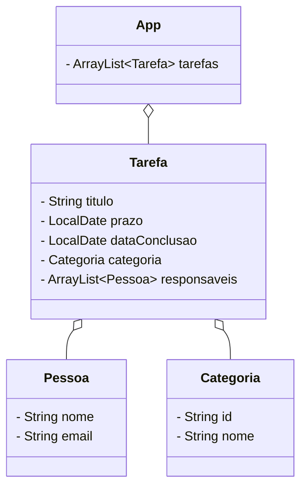

```mermaid
classDiagram
    class Tarefa{
        - String titulo
        - LocalDate prazo
        - LocalDate dataConclusao
        - Categoria categoria
        - ArrayList~Pessoa~ responsaveis
    }
    
    class Pessoa{
        - String nome
        - String email
    }
    
    class Categoria{
        - String id
        - String nome
    }
    
    class App{
        - ArrayList~Tarefa~ tarefas
    }
    
    App o-- Tarefa
    Tarefa o-- Pessoa
    Tarefa o-- Categoria
```