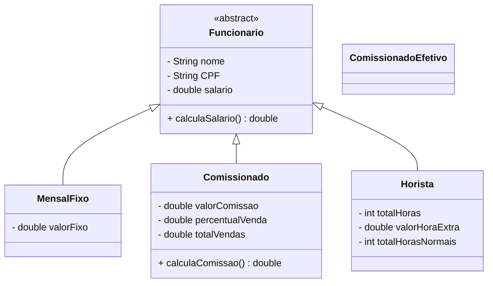

```mermaid
    classDiagram
    class Funcionario {
        <<abstract>>
        - String nome
        - String CPF 
        - double salario
        + calculaSalario() double
    }
    
    class MensalFixo {
        - double valorFixo
    }
    
    
    class Comissionado {
        - double valorComissao
        - double percentualVenda
        - double totalVendas
        + calculaComissao() double
    }
    
    class Horista {
        - int totalHoras
        - double valorHoraExtra
        - int totalHorasNormais
    }
    
    class ComissionadoEfetivo {
        
    }
    
    Funcionario <|-- MensalFixo
    Funcionario <|-- Comissionado
    Funcionario <|-- Horista
```