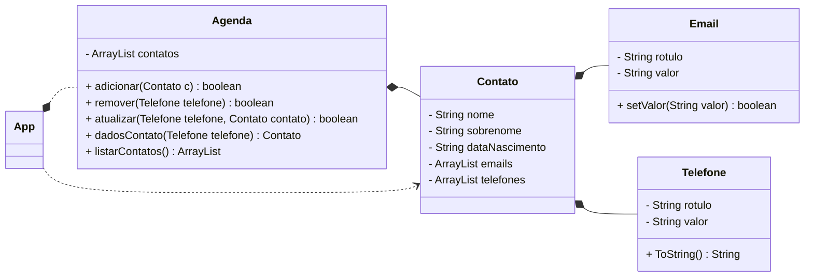

# Diagrama de classes UML

```mermaid
classDiagram
    
    direction LR 
    class App{
        
    }
    
    class Contato{
        - String nome
        - String sobrenome
        - String dataNascimento
        - ArrayList<Email> emails
        - ArrayList<Telefone> telefones
    }
    
    class Email{
        - String rotulo
        - String valor
        + setValor(String valor) boolean
    }
    
    class Telefone{
        - String rotulo
        - String valor
        + ToString() String
    }

    Contato *-- Email
    Contato *-- Telefone
    
    class Agenda {
        - ArrayList<Contato> contatos
        + adicionar(Contato c) boolean
        + remover(Telefone telefone) boolean
        + atualizar(Telefone telefone, Contato contato) boolean
        + dadosContato(Telefone telefone) Contato
        + listarContatos() ArrayList<Contato>
        
    }
    
    Agenda *-- Contato
    App *.. Agenda
    App ..> Contato
    
    
    
    
    

```