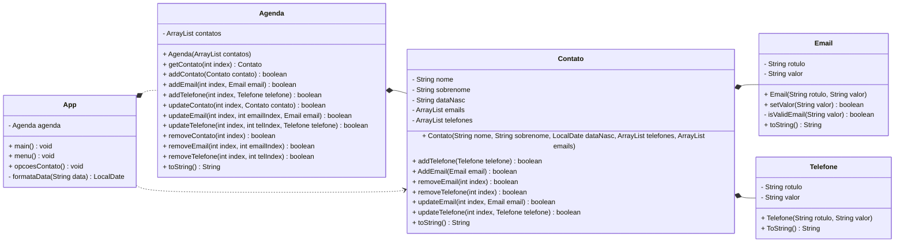

# Diagrama de classes UML

```mermaid
classDiagram
    
    direction LR 
    class App{
         - Agenda agenda
         + main() void
         + menu() void
         + opcoesContato() void
         - formataData(String data) LocalDate
    }
    
    class Contato{
        - String nome
        - String sobrenome
        - String dataNasc
        - ArrayList<Email> emails
        - ArrayList<Telefone> telefones
        + Contato(String nome, String sobrenome, LocalDate dataNasc, ArrayList<Telefone> telefones, ArrayList<Email> emails)
        + addTelefone(Telefone telefone) boolean
        + AddEmail(Email email) boolean
        + removeEmail(int index) boolean
        + removeTelefone(int index) boolean
        + updateEmail(int index, Email email) boolean
        + updateTelefone(int index, Telefone telefone) boolean
        + toString() String
    }
    
    class Email{
        - String rotulo
        - String valor
        + Email(String rotulo, String valor)
        + setValor(String valor) boolean
        - isValidEmail(String valor) boolean
        + toString() String
    }   
    
    class Telefone{
        - String rotulo
        - String valor
        + Telefone(String rotulo, String valor)
        + ToString() String
    }

    Contato *-- Email
    Contato *-- Telefone
    
    class Agenda {
        - ArrayList<Contato> contatos
        + Agenda(ArrayList<Contato> contatos)
        + getContato(int index) Contato
        + addContato(Contato contato) boolean
        + addEmail(int index, Email email) boolean
        + addTelefone(int index, Telefone telefone) boolean
        + updateContato(int index, Contato contato) boolean
        + updateEmail(int index, int emailIndex, Email email) boolean
        + updateTelefone(int index, int telIndex, Telefone telefone) boolean
        + removeContato(int index) boolean
        + removeEmail(int index, int emailIndex) boolean
        + removeTelefone(int index, int telIndex) boolean
        + toString() String
    }
    
    Agenda *-- Contato
    App *.. Agenda
    App ..> Contato
    
    
    
    
    

```