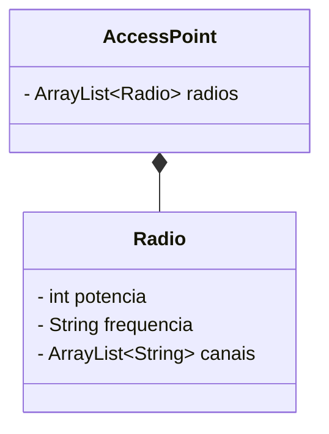
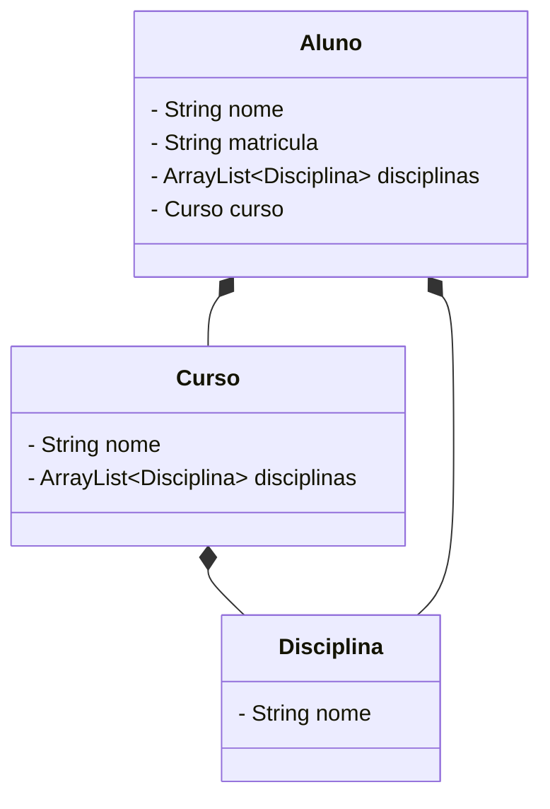
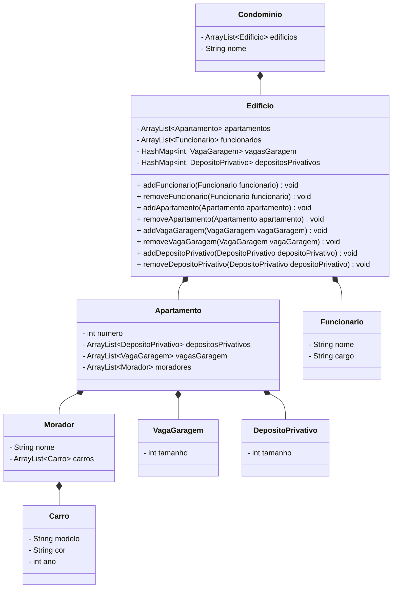
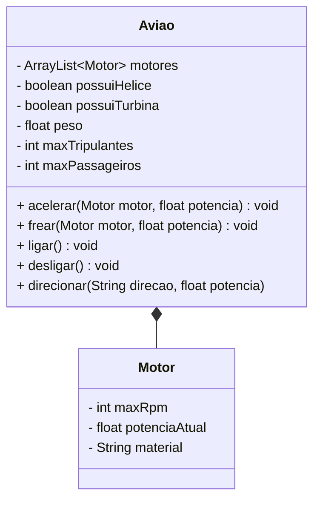

# Diagrama de classes UML

```mermaid
classDiagram
    class AccessPoint{
        - ArrayList~Radio~ radios
    }
    
    class Radio {
        - int potencia
        - String frequencia
        - ArrayList~String~ canais
    }

    AccessPoint *-- Radio
```

```mermaid
classDiagram
    class Aluno {
        - String nome
        - String matricula
        - ArrayList~Disciplina~ disciplinas
        - Curso curso
        
    }
    
    class Disciplina {
        - String nome 
    }
    
    class Curso {
        - String nome
        - ArrayList~Disciplina~ disciplinas
    }
    
    Curso *-- Disciplina
    Aluno *-- Curso
    Aluno *-- Disciplina
```

```mermaid
classDiagram
    class Edificio {
        - ArrayList~Apartamento~ apartamentos
        - ArrayList~Funcionario~ funcionarios
        - HashMap~int, VagaGaragem~ vagasGaragem
        - HashMap~int, DepositoPrivativo~ depositosPrivativos
        + addFuncionario(Funcionario funcionario) void
        + removeFuncionario(Funcionario funcionario) void
        + addApartamento(Apartamento apartamento) void
        + removeApartamento(Apartamento apartamento) void
        + addVagaGaragem(VagaGaragem vagaGaragem) void
        + removeVagaGaragem(VagaGaragem vagaGaragem) void
        + addDepositoPrivativo(DepositoPrivativo depositoPrivativo) void
        + removeDepositoPrivativo(DepositoPrivativo depositoPrivativo) void
    }
    
    class Apartamento {
      - int numero
      - ArrayList~DepositoPrivativo~ depositosPrivativos
      - ArrayList~VagaGaragem~ vagasGaragem
      - ArrayList~Morador~ moradores
    }
    
    class Morador {
        - String nome
        - ArrayList~Carro~ carros
    }

    class Funcionario {
        - String nome
        - String cargo
    }

    class VagaGaragem {
        - int tamanho
    }

    class DepositoPrivativo {
        - int tamanho
    }

    class Carro {
        - String modelo
        - String cor
        - int ano
    }

    class Condominio {
        - ArrayList~Edificio~ edificios
        - String nome
    }

    Condominio *-- Edificio
    Edificio *-- Funcionario
    Edificio *-- Apartamento
    Apartamento *-- Morador
    Apartamento *-- VagaGaragem
    Apartamento *-- DepositoPrivativo
    Morador *-- Carro
   
```

```mermaid
classDiagram
   class Aviao {
       - ArrayList~Motor~ motores
       - boolean possuiHelice
       - boolean possuiTurbina
       - float peso
       - int maxTripulantes
       - int maxPassageiros
       + acelerar(Motor motor, float potencia) void
       + frear(Motor motor, float potencia) void
       + ligar() void
       + desligar() void
       + direcionar(String direcao, float potencia)
   }
  
   class Motor {
       - int maxRpm
       - float potenciaAtual
       - String material
   }
  
  
  
   Aviao *-- Motor
  
```

