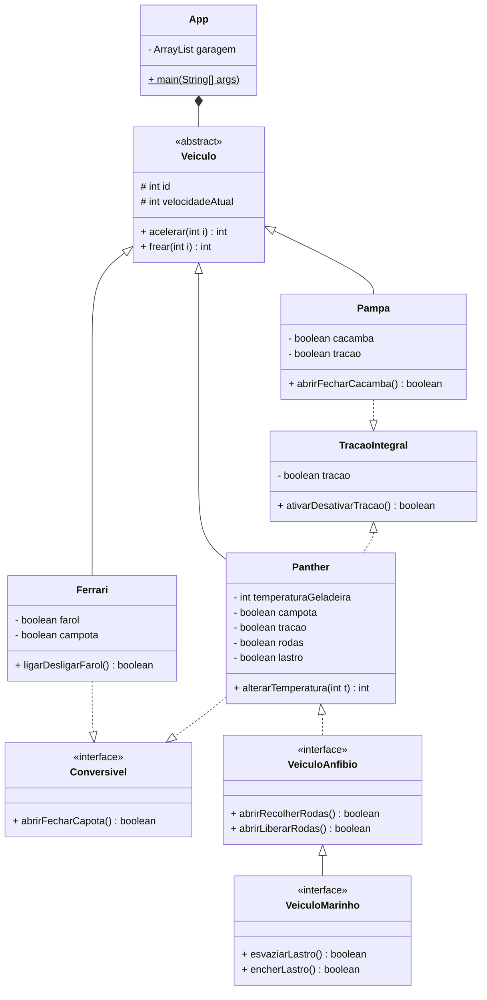

```mermaid
    classDiagram
        class App{
            - ArrayList<Veiculo> garagem
            + main(String[] args)$
        }
        
        class Veiculo {
            <<abstract>>
            # int id
            # int velocidadeAtual
            + acelerar(int i) int
            + frear(int i) int
        }
        
        App *-- Veiculo

        class Ferrari {
            - boolean farol
            - boolean campota
            + ligarDesligarFarol() boolean
        }
        
        class Pampa {
            - boolean cacamba
            - boolean tracao
            + abrirFecharCacamba() boolean
        }
        
        class Panther{
            - int temperaturaGeladeira
            - boolean campota
            - boolean tracao
            - boolean rodas
            - boolean lastro
            + alterarTemperatura(int t) int
        }

        Veiculo <|-- Ferrari
        Veiculo <|-- Pampa
        Veiculo <|-- Panther
        
        class Conversivel{
            <<interface>>
            + abrirFecharCapota() boolean
        }

        Ferrari..|> Conversivel
        Panther ..|> Conversivel
        
        class TracaoIntegral {
            - boolean tracao
            + ativarDesativarTracao() boolean
        }
        
        Pampa ..|> TracaoIntegral
        TracaoIntegral <|.. Panther
        
        class VeiculoAnfibio {
            <<interface>>
            + abrirRecolherRodas() boolean
            + abrirLiberarRodas() boolean
        }
        
        Panther <|.. VeiculoAnfibio
        
        class VeiculoMarinho {
            <<interface>>
            + esvaziarLastro() boolean
            + encherLastro() boolean
        }
        
        VeiculoAnfibio <|-- VeiculoMarinho
        
        
        
        
        
```