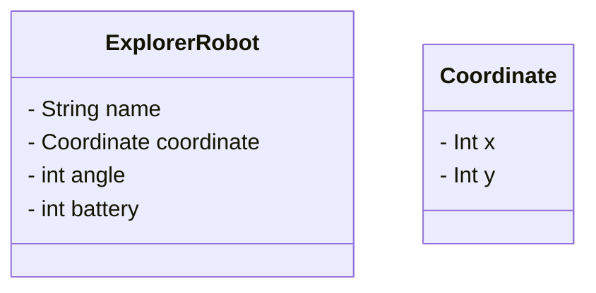

```mermaid
classDiagram

    class ExplorerRobot{
        - String name
        - Coordinate coordinate
        - int angle
        - int battery
    }
    
    class Coordinate {
        - Int x
        - Int y
    }
    
    
    
```